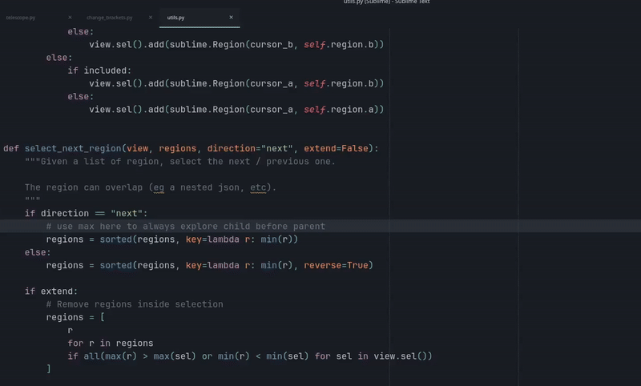

# Sublime - Telescope
Sublime text plugin that mimic the "live grep" feature of the [telescope](https://github.com/nvim-telescope/telescope.nvim) plugin from VIM.

That plugin work with [ripgrep](https://github.com/BurntSushi/ripgrep) and [fzf](https://github.com/junegunn/fzf)

It will **fuzzy find** in all files in the current project,
- it will first use ripgrep, if you enter `acbd`, it will look for the regex `.*a.*b.*c.*d.*`
- it will apply fuzzy search on the result with fzf
- it will keep the 5000 best results (fzf scoring)

[](https://youtu.be/Durb2wwCmD0)

Ripgrep and fzf are configured in **"smart case"** mode (case insensitive if everything is lower case, case-sensitive otherwise).

The results are shown in an output panel; use the up/down arrows to navigate them (the highlighted result is previewed), enter to open it and escape to cancel and go back where you was.

To reduce the search space in project mode, put a directory glob, two spaces, then the search query:
- `models  search_user`: search for `search_user` in directories matching `models`
- `enterprise/*/models  search_user`: search in matching model directories
- `models,views  kanban`: search in directories matching either `models` or `views`

Without two spaces, the whole input is used as the search query. Current-file mode ignores the directory glob in the input; when switching back to project mode, the previous directory glob is shown again.

In addition to the default `ripgrep` behavior (ignoring file specified in `.gitignore`, etc), it will ignore files matching
- `binary_file_patterns`
- `file_exclude_patterns`
- `folder_exclude_patterns`

Debian / Ubuntu
> sudo apt install ripgrep fzf

MacOS
> brew install ripgrep fzf

Windows with choco
> Set-ExecutionPolicy Bypass -Scope Process -Force; [System.Net.ServicePointManager]::SecurityProtocol = [System.Net.ServicePointManager]::SecurityProtocol -bor 3072; iex ((New-Object System.Net.WebClient).DownloadString('https://community.chocolatey.org/install.ps1'))

> choco install ripgrep fzf

# Settings
See `Preferences > Package Settings > Telescope > Settings` to tweak the number of results, the search debounce delay, the ripgrep arguments, etc.

# Keybind
```json
{
    "keys": ["ctrl+i"],
    "command": "telescope",
    "args": {"current_file": true}
}
```

Search in the project:
```json
{
    "keys": ["ctrl+shift+i"],
    "command": "telescope"
}
```

# TODO
- get the x first result with rg instead of head
